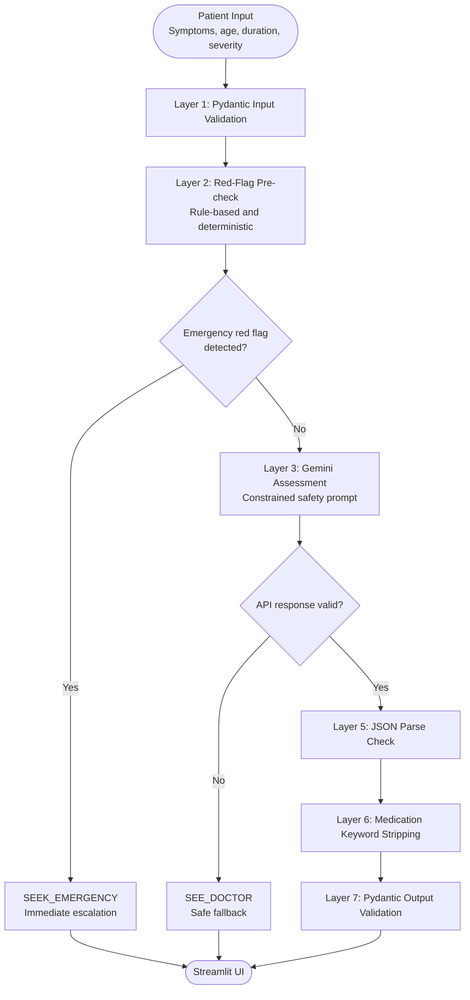

# 🏥 SymptomSense AI

> Not a diagnosis tool. A triage tool.
> One question answered: should you go to the ER,
> see a doctor, or rest at home?
> Powered by Gemini 2.0 Flash +
> rule-based safety layers.


---

## 🎯 Real World Problem

> **JAMA Network Open, 2024** — up to 60% of all
> ER visits are considered non-urgent and
> potentially unnecessary.
>
> **Healthcare Cost Institute, 2024** — average
> ER visit costs $2,400–$2,600 without insurance.
> Average urgent care visit: $185.
> More than 10x cheaper for non-emergencies.
>
> **Estimated $8.3 billion** spent annually on
> ER care that could have been provided in a
> less costly setting.

People Google symptoms at 2am and either panic
into an expensive ER visit or ignore something
that needs attention. SymptomSense answers
the one question that actually matters first:
what level of care do you need right now?

---

## 🛡️ Safety Design

This project is built around responsible AI
design — not just capability.

**7 Safety Layers:**
1. Input validation (Pydantic)
2. Red flag pre-check (rule-based, no LLM)
3. Constrained system prompt
4. API failure fallback (escalate, never downgrade)
5. JSON parse failure handling
6. Medication keyword stripping
7. Pydantic output validation

**Key design decision:**
Emergency detection runs BEFORE the API call.
Rule-based keyword matching is deterministic —
it cannot hallucinate. LLMs are probabilistic.
For life-critical detection, deterministic wins.

See [SAFETY_DESIGN.md](./SAFETY_DESIGN.md)
for full documentation of every decision.

---

## ✨ Features

- 🚨 Always-visible emergency numbers
- 🔍 Real-time red flag detection
  (before form submission)
- 🏥 3 triage levels:
  SEEK_EMERGENCY / SEE_DOCTOR / MONITOR_HOME
- 📊 Urgency score 1–10 with color-coded bar
- ⚠️ Red flags present + watch list
- 📋 Immediate steps (medication-free)
- 👨‍⚕️ What to tell your doctor
- ⚠️ Mandatory disclaimer on every result

---

## 🏗️ Architecture



---

## 🛠️ Tech Stack

| Layer | Tool |
|---|---|
| LLM | Gemini 3.1 Flash Instant preview |
| Safety Pre-check | Rule-based (Python) |
| Validation | Pydantic |
| UI | Streamlit |
| Language | Python 3.14 |

---

## 🚀 Run Locally
```bash
git clone https://github.com/vedap24/ai-portfolio
cd 07-symptomsense

source ../venv/bin/activate  # Mac/Linux
..\venv\Scripts\activate     # Windows

pip install -r requirements.txt
echo "GEMINI_API_KEY=your_key" > .env

streamlit run ui.py
```

---

## ⚠️ Disclaimer

SymptomSense is an AI triage assistant for
educational and demonstration purposes.
It is NOT a substitute for professional
medical advice, diagnosis, or treatment.
Always consult a qualified healthcare
provider for medical decisions.
In an emergency, call 112 (India) or
911 (US) immediately.
