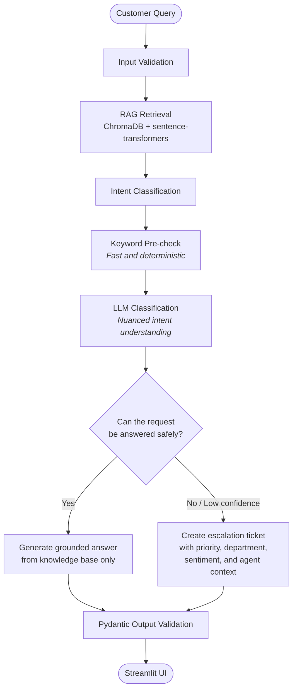

# 🎧 SupportSense AI

> AI-powered customer support with
> intelligent escalation logic.
> Answers from KB instantly —
> escalates to humans when needed.
> Powered by RAG + Gemini 2.0 Flash.


---

## 🎯 Real World Problem

> **Gartner, 2026** — 98% of customer service
> leaders say smooth AI-to-human transitions
> are essential. 90% admit they struggle
> with handoffs. Getting escalation right
> matters more than the AI itself.
>
> **AI Customer Service Market, 2026** —
> $15.12 billion market. Companies see
> $3.50 return for every $1 invested.
> Klarna's AI handled 2/3 of all support
> conversations — equivalent to 700 agents.
>
> **Cost per interaction dropped 68%** —
> from $4.60 to $1.45 after AI implementation.
> (2025 industry benchmarks)

The problem isn't building a chatbot.
Every company has a chatbot.
The problem is knowing when NOT to answer —
and handing off with full context
when escalation is needed.
That's what SupportSense solves.

---

## 🏗️ Architecture

SupportSense uses a **retrieval-first support workflow**: it validates the query, retrieves relevant knowledge-base context, classifies the request, and either responds safely or escalates it with agent-ready context.



### Decision logic

- **Answerable:** SupportSense generates a response only from retrieved knowledge-base content.
- **Escalate:** Billing, complaints, sensitive requests, unknown intents, or low-confidence responses are routed to a structured support ticket.
- **Validation:** Pydantic checks the final answer or ticket data before it is displayed in the Streamlit interface.

---

## ✨ Features

- 📚 RAG from custom knowledge base
  (runs locally, zero cost)
- 🎯 Intent classification:
  answerable / billing / complaint /
  technical / unknown
- ✅ Cited answers with source sections
- 🔺 Structured escalation tickets with:
  priority, department, sentiment,
  suggested resolution, agent context
- 📊 Auto-resolution rate tracker
- 💡 Follow-up question suggestions
- ⚡ Keyword pre-check before LLM call
- 🔄 Low-confidence answers auto-escalate

---

## 🛠️ Tech Stack

| Layer | Tool |
|---|---|
| KB Embeddings | sentence-transformers (local) |
| Vector Store | ChromaDB (local) |
| Intent + Answer | Gemini 2.0 Flash |
| Validation | Pydantic |
| UI | Streamlit |
| Language | Python 3.12 |

---

## 🚀 Run Locally
```bash
git clone https://github.com/vedp9/AI-Product-Studio.git
cd AI-Product-Studio/labs/rag-systems/supportsense

source ../../../venv/bin/activate  # Mac/Linux
..\..\..\venv\Scripts\activate     # Windows

pip install -r requirements.txt
echo "GEMINI_API_KEY=your_key" > .env

streamlit run ui.py
```

---

## 🧠 What I Learned

- The escalation logic is more valuable
  than the answer logic —
  knowing when NOT to answer is the
  senior engineering insight
- Two-step intent classification:
  keyword check first (no API cost),
  LLM second (nuanced cases only)
- Confidence threshold routing —
  LOW confidence answers auto-escalate
  rather than risk giving wrong info
- RAG without source citation = guessing.
  RAG with source citation = trust.
- Pydantic's Optional fields let
  one model handle both answer
  and escalation responses cleanly
